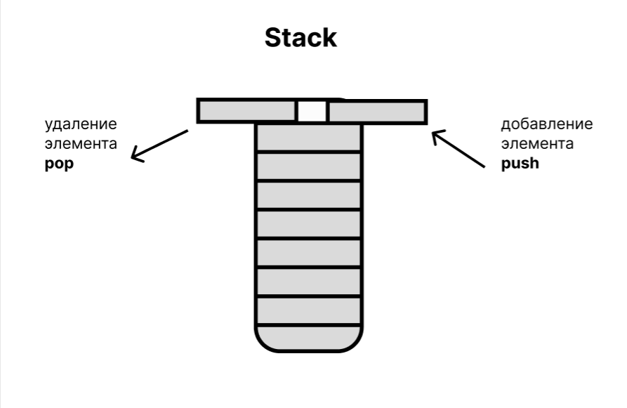
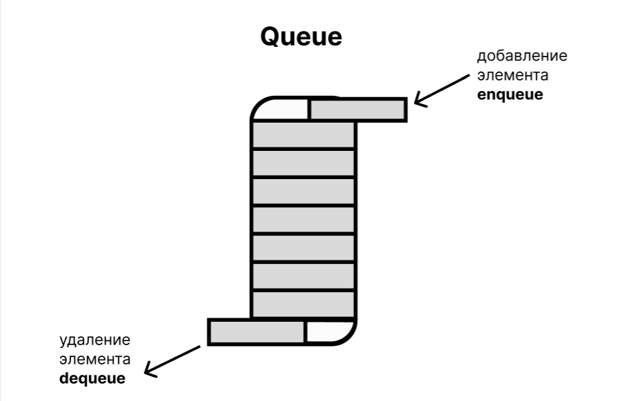
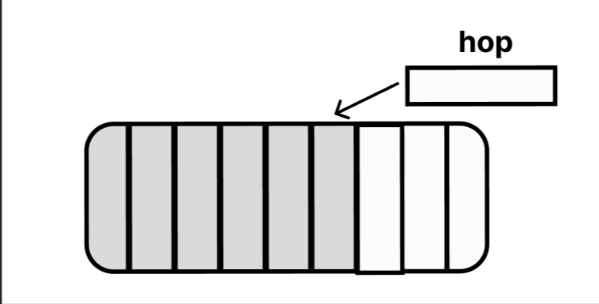
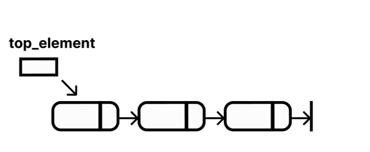
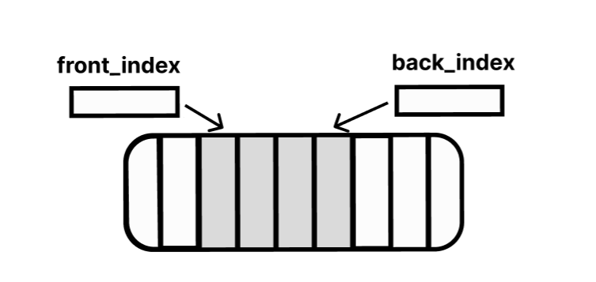
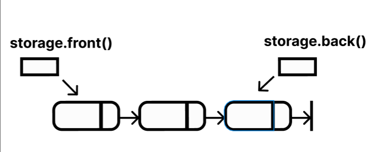
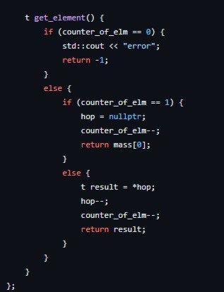
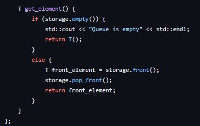
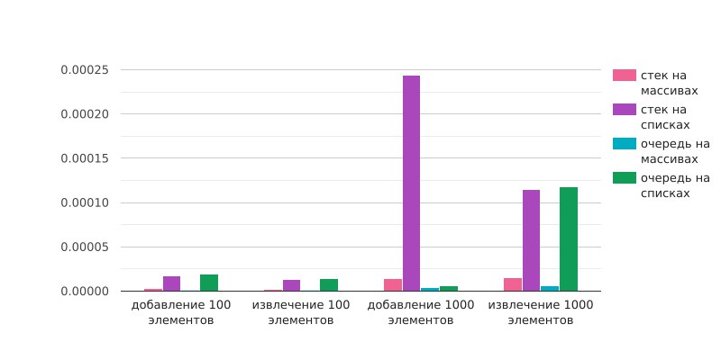

# Очередь и стеки
## Задача: реализовать стек и очередь на массивах и списках.
В данном репозитории представлена реализация структур данных - очередей и стеков на массивах и списках на языке программирования C++.
### Stack
Стек (stack) - это структура данных, в которой добавление и удаление элементов происходит только с одного конца (вершины). Реализация стека на массиве и на списках позволяет эффективно управлять данными.

### Queue
Очередь (queue) - это структура данных, в которой элементы добавляются в конец очереди и извлекаются из её начала. Реализация очереди на массиве и на списках позволяет эффективно управлять данными.

# Решение
## Детали реализации
### Вашему вниманию представленны графически детали реализаций

|абстракция|детали абстракции|
|--------|--------|
||hop - указатель на последний добавленый в стек элемент|
||top_element - указатель на последний добавленный в очередь элемент|
||back_index - указатель на последний вошедший элемент в стек, а front_index - на первый вошедший элемент|
||storage.back() - указатель на последний вошедший элемент в очередь, а storage.front() - на первый вошедший элемент|

## Пограничные случаи
### Рассмотрим для каждой выше абстракции пограничные случаи.
|абстракция|картинка|пограничные случаи|
|--------|--------|--------|
|стек на массивах||<ol><li>Массив  полн. Проблема добавления: нет места для добавления. </li><li>Массив пуст. Проблема извлечения: указатель ни на что не указывает, нечего извлекать из пустоты.</li></ol>|
|стек на списках||
-----
|
|очередь на массивах||<ol><li>Массивполн. Проблема добавления: нет места для добавления.</li><li>Массив пуст. Проблема извлечения: указатель ни на что не указывает, нечего извлекать из пустоты.</li></ol>|
|очередь на списках||
-----
|

## Реализация на С++
### Реализованно с помощью структур

|структура данных|поляструктуры|функциядобавления|функция извлечения|
|--------|--------|--------|--------|
|стекнамассивах||||
|стекнасписках||||
|очередьнамассивах||||
|очередьнасписках||||

# Заключение 

### Ниже представленно табличное сравнение добавление и извлечения элементов: 

|структура данных|добавление 100 элементов|извлечение 100 элементов|добавление 1000 элементов|извлечение 1000 элементов|
|--------|--------|--------|--------|--------|
|стек на массивах| 0.000003 сек. | 0.000002 сек.| 0.000014 сек. | 0.000015 сек. |
|стек на списках| 0.000017 сек. | 0.000013 сек. | 0.000244 сек. | 0.000115 сек. |
|очередь на массивах|0.000001 сек.|0.000001 сек.| 0.000004 сек.| 0.000006 сек.|
|очередь на списках| 0.000019 сек. |  0.000014 сек. | 0.000155 сек. | 0.000118 сек. |

### Ниже представленно в виде графика сравнение добавление и извлечения элементов:

## Заключение 
В ходе исследования было выявлено, что стэк на массиве и стэк на списке отличаются друг от друга в основном способом хранения данных. В стэке на массиве элементы хранятся в непрерывном блоке памяти, что делает его более эффективным в доступе к элементам по индексу. В то время как в стэке на списке элементы хранятся в виде связанных узлов, обеспечивая гибкость в добавлении и удалении элементов.

По сравнению с этим, очередь на массиве и очередь на списке также отличаются способом хранения данных. Очередь на массиве имеет ограниченную длину и элементы добавляются в конец и удаляются из начала массива. В то время как очередь на списке не имеет ограничений и добавление и удаление элементов происходит с помощью указателей на начало и конец списка.

Таким образом, выбор структуры данных для реализации стэка или очереди зависит от конкретных требований по производительности и гибкости операций.
